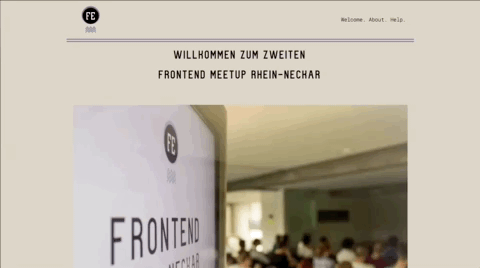

# Demo-Seite zum Thema a11y

**vom [Frontend Rhein-Neckar #2](https://www.meetup.com/de-DE/Frontend-Rhein-Neckar/events/252148498/)**

[➡️ zu den zugehörigen Präsentationen]() <!-- TODO: Link zu dem Präsentationen -->

## 🚀 Setup

*node-Version 8.9.0*

* [yarn](https://yarnpkg.com/en/docs/install) installieren
* Dependencies installieren: `yarn`
* Dev-Server starten: `yarn start`

## ℹ️ Was ist das hier?

> a11y = Accessibility

Dies ist ein kleines Webseite-Projekt, anhand dessen du in der Lage sein sollst, mit a11y-Optimierungen herumzuprobieren.

Um zu sehen, was alles möglich ist, kannst du die beiden Branches `master` *(soll-Zustand)* und `desaster` <!-- TODO: tatsächlichen Branch-Namen eintragen --> *(ist-Zustand)* vergleichen.

Auf folgendes solltest Du hier dein Augenmerk richten:

* aria-Labels
*  <!-- TODO: weitere eintragen --> 

## ♿️ a11y-Testing

Diese Tools kannst du zum Testen deiner Seite verwenden:

* [Lighthouse](https://developers.google.com/web/tools/lighthouse/) in Chrome
* <!-- TODO: weitere Tools zum Testen eintragen eintragen --> 

## 🚚 Production build

`yarn run build`

## 🌐 Weiterführende Links

* [Infos zum FERN #2 auf dem Bitspeicher Blog](https://bitspeicher.blog/frontend-rhein-neckar-2-a11y/)
* Frontend Rhein-Neckar auf...
	* [Meetup.com](https://www.meetup.com/de-DE/Frontend-Rhein-Neckar/)
	* [Twitter](https://twitter.com/FrontendRN)